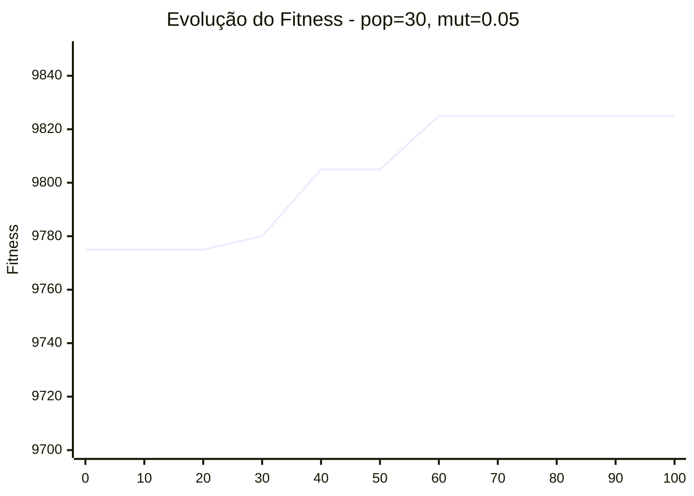
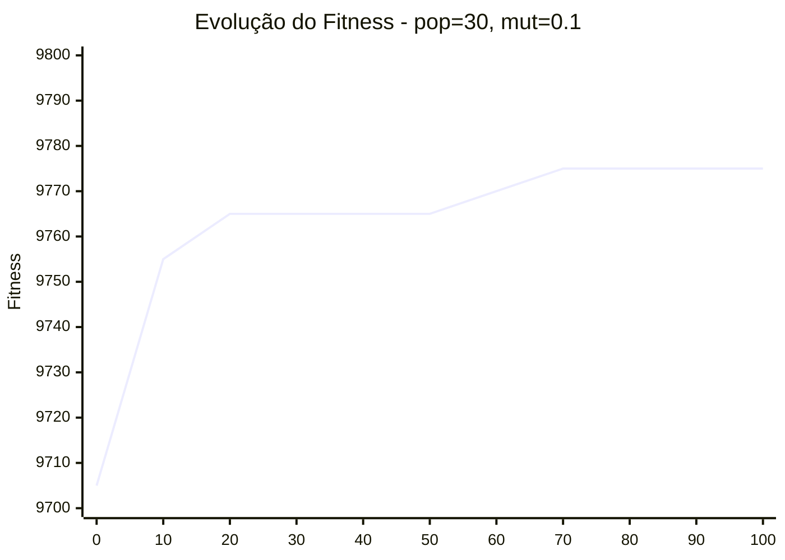
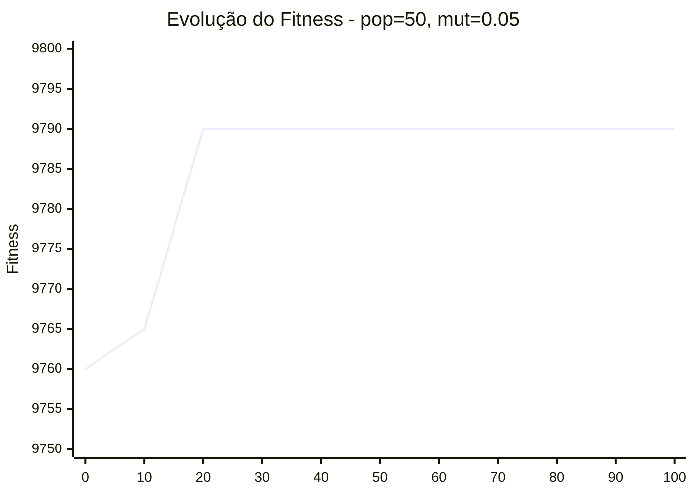
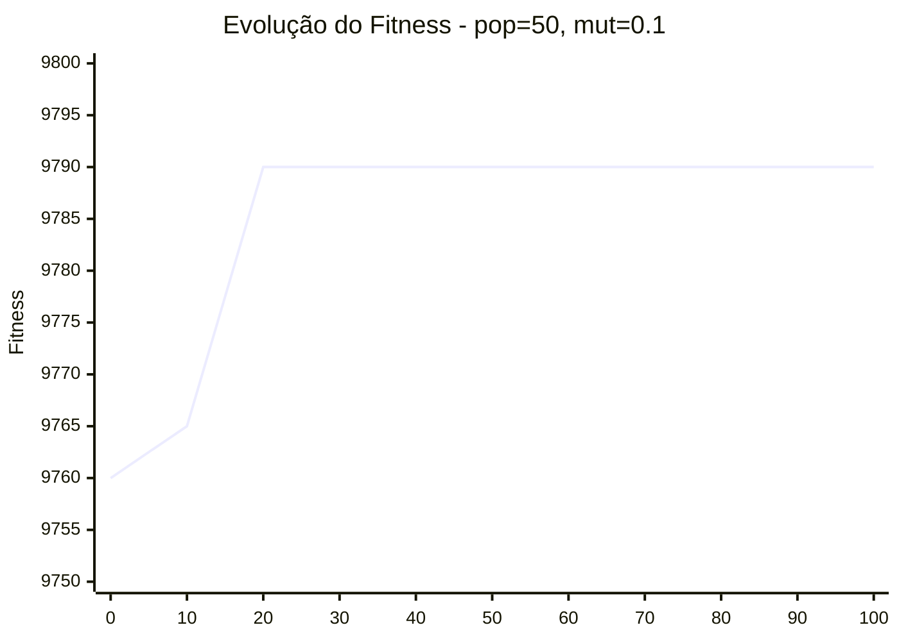

## Experimentos com Hiperparâmetros

Foram realizados experimentos variando dois hiperparâmetros principais do algoritmo genético:

- Tamanho da população  
- Taxa de mutação 

## Resultados dos Experimentos

| População | Mutação | Melhor Fitness | Geração até Convergência | Violações |
|----------|--------|---------------|--------------------------|----------|
| 30       | 0.05   | 9825          | 66                       | 0        |
| 30       | 0.1    | 9775          | 57                       | 0        |
| 50       | 0.05   | 9790          | 16                       | 0        |
| 50       | 0.1    | 9790          | 19                       | 0        |

## Gráficos de Convergência

### População = 30 | Mutação = 0.05

### População = 30 | Mutação = 0.1

### População = 50 | Mutação = 0.05

### População = 50 | Mutação = 0.1

## Análise dos resultados 

Os gráficos foram construídos a partir de amostras do histórico de fitness para melhor visualização da tendência de convergência ao longo das gerações.

Observa-se que a combinação de menor tamanho de população (30) com menor taxa de mutação (0.05) apresentou o melhor desempenho, alcançando o maior valor de fitness (9825), embora tenha exigido mais gerações para convergir. 

Taxas de mutação mais altas (0.1) resultaram em soluções de menor qualidade, possivelmente devido ao excesso de aleatoriedade, dificultando a convergência. 

Já populações maiores (50) apresentaram convergência mais rápida, porém com soluções ligeiramente inferiores, indicando convergência precoce do algoritmo.

Para população de tamanho 50, a variação da taxa de mutação (0.05 e 0.1) não impactou significativamente o desempenho do algoritmo. Isso indica que uma população maior já fornece diversidade suficiente, reduzindo a influência da mutação no processo evolutivo.

Em todos os experimentos, não houve violações nas soluções finais, demonstrando que o algoritmo respeita corretamente as restrições do problema. 

Para população de tamanho 50, a variação da taxa de mutação (0.05 e 0.1) não impactou significativamente o desempenho do algoritmo. Isso indica que uma população maior já fornece diversidade suficiente, reduzindo a influência da mutação no processo evolutivo.

Conclui-se que há um equilíbrio entre exploração e convergência, sendo que parâmetros que evitam convergência precoce tendem a produzir melhores resultados.
